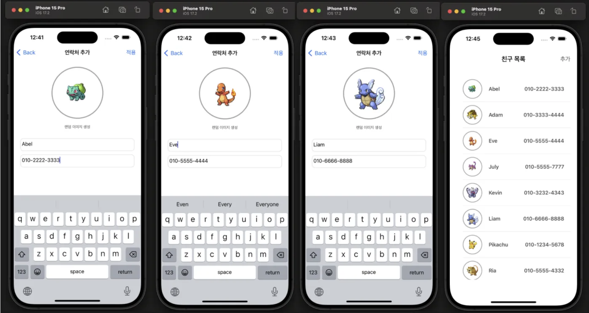
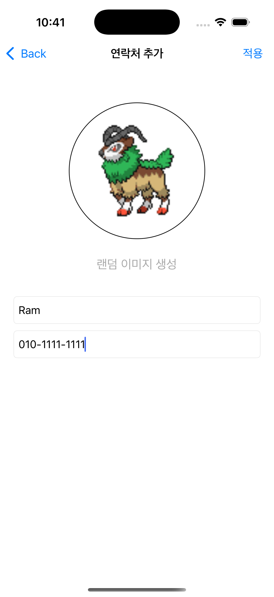
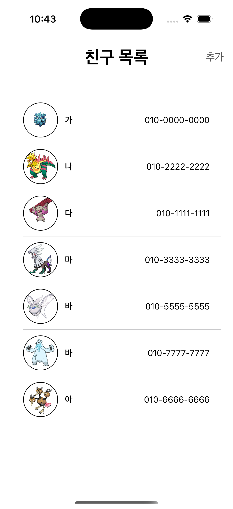

# **Poketmon PhoneBook**

  

  🚀 앱 개발 숙련 주차 과제 포켓몬 연락처 앱 제작 
  

  

  

---

## 주요 기능
- 랜덤 포켓몬 이미지 생성
- 포켓몬 이름 , 전화번호 생성 후 저장 기능
- 저장한 포켓몬 이름, 전화번호 표시
- 이름을 기준으로 정렬 가능

## 사용 기술

- Swift
- UIkit
- SnapKit
- Core Data
- URLSession

## 🖼️ 화면 예시

### 연락처 추가 화면

### 친구 목록 화면

